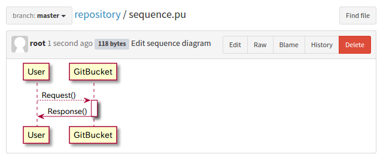

gitbucket-plantuml-plugin
========
A GitBucket plugin that renders [PlantUML](http://plantuml.com/) diagrams.



Usage
-----
After the plug-in it's installed, just create files with one of the following extensions: ```*.pu```, ```*.puml``` or ```*.plantuml``` that contain the PlantUML specific block:
```
@startuml
<<you UML code goes here>>
@enduml
```

Compatibility
-------------
Plugin version | GitBucket version
:--------------|:-----------------
1.2.x          | >= 4.12.y
1.1.x          | >= 4.11.y
1.0.x          | >= 4.10.y

Installation
------------
 - Download the latest plug-in JAR from [[Releases](https://github.com/nus/gitbucket-plantuml-plugin/releases)] and copy it to ```$GITBUCKET_HOME/plugins/```.
 - Restart GitBucket

Alternatively you can build the plug-in yourself from the sources like it's described below.

**Note:** For most diagram types to be rendered correctly, GraphViz also must be present on the system. For details, see: http://plantuml.com/graphviz-dot .

Building
----

**Prerequisites:** Scala and SBT installed and working on your system, e.g. with the help of [SDKMNAN!](http://sdkman.io/) .
 
Run the command below in the root directory of the plug-in in order to build it:

```
sbt assembly
```

The plugin is built at `target/scala-2.12/gitbucket-plantuml-plugin-assembly-x.y.z.jar` and it should be copied to ```$GITBUCKET_HOME/plugins/``` directory.


License
----

   Copyright 2017 Yota Ichino

   Licensed under the Apache License, Version 2.0 (the "License");
   you may not use this file except in compliance with the License.
   You may obtain a copy of the License at

      http://www.apache.org/licenses/LICENSE-2.0

   Unless required by applicable law or agreed to in writing, software
   distributed under the License is distributed on an "AS IS" BASIS,
   WITHOUT WARRANTIES OR CONDITIONS OF ANY KIND, either express or implied.
   See the License for the specific language governing permissions and
   limitations under the License.

Relating sofware license
----

This plugin contains PlantUML library which exists at `lib` directory.
The library licensed under the Apache License, Version 2.0.
